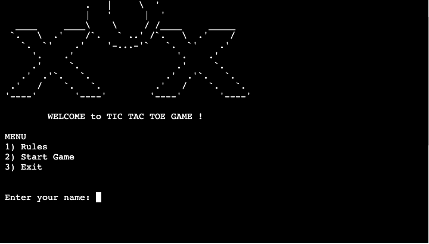
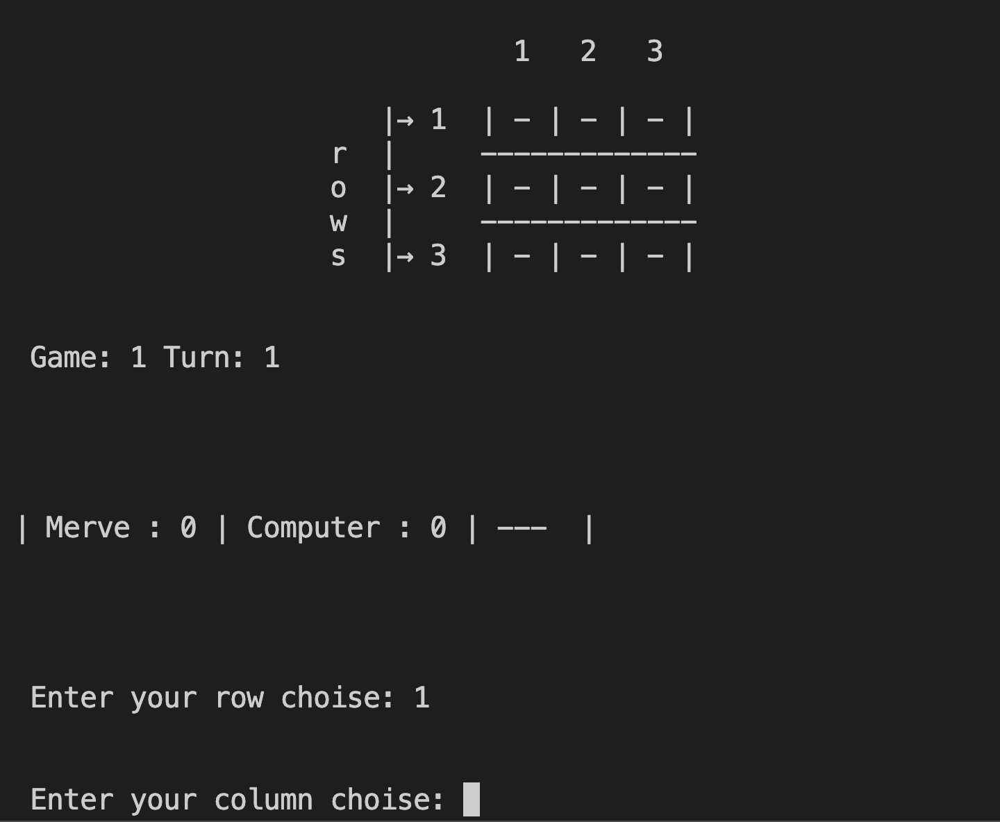

 # XOX-GAME
 [XOX-GAME](https://tic-tac-toe-game-merve-f793c47a141b.herokuapp.com/) This project is a game project. It is a popular game also known as tic-tac-toe-game. XOX-GAME is run and played within the terminal. The system runs on a mock terminal through [Heroku](https://id.heroku.com/login) It is a game that can be played 3 times between the computer and one player and results in winning, drawing or losing.
 Click here to play the game: [XOX-GAME](https://tic-tac-toe-game-merve-f793c47a141b.herokuapp.com/)

 

 # User Experience(UX)

 ## User Stories:

   * As a user, I want to be able to easily understand the purpose of the site when I open it.
   * As a user, I want to easily access and understand the rules I need to follow.
   * As a user, I want to easily navigate between steps on the game.
   * As a user, I want to start the game easily and access the gameboard without any problems.
   * As a user, I want to easily move on to the next steps with necessary warnings and explanations after the moves you make.
   * As a user, you have the right to play this game 3 times, see the result at the end of the game and start the next game easily.

## How to Play

When we click on the live link [XOX-GAME](https://tic-tac-toe-game-merve-f793c47a141b.herokuapp.com/) to start the game, we are greeted with this start screen. We see a menu that will help guide us, and we proceed by typing a number between 1 and 3 to select the option we want.

 ### If we choose 1 from the menu

 

If we choose 1. The rules tab will open and we can see the rules of the game as shown in the picture above.

### If we choose 2 from the menu

 

If we choose 2, the game will start and ask us to enter a username. If an invalid character is entered, we will see a warning message on this screen.

### If we choose 3 from the menu

If 3 is selected from the menu, you will be exited and this screen will be seen.

## Features

### Existing Features

After entering the username, the next step is to start the game and a choice is made between X and O(we use letter O, it is not a number)

After the sign is selected, the computer and the user randomly choose who will start playing first and the game begins.

Then, who will play first is written on the screen, and if the player is selected to make the first move, after the initial score information is given, player is asked for information on which cell player will tick on the game board and the choice is made.

#### for row:

#### for column:

After the choice is made, we can see the sign placed on the game board.

If the computer is going to play first, a message is given that the computer will play, then the move is passed to the other player.

If the player wants to re-select a previously selected location, player will encounter a warning like the one in the picture below.

If one of the players wins, the warning "{Username} Won / Computer Won" is printed on the screen.

If the player loses, the warning "{username} lost " is printed on the screen.

If the game ends in a tie, "Game is tie!" appears on the screen.

## Data Model
You can see the logical flow diagram here.

[flowchart diagram](images/flowchart.drawio-1.png)

## Future Features

  * More players may be included.
  * If we want to extend the game time, we can increase our playing rights, which are currently 3, to the desired number later.
  * We can add more cells to the game board.
  * We can make a different arrangement of the game by creating difficulty levels.

## Testing

The steps I followed while testing my project were as follows:
  * Tested in the local terminal and the Code institute Heroku Terminal.
  * Testing the programs code in pep8online and confirmed that there were no errors with the code.
  * I experimented by making choices that were outside the rules of the game and tested whether the game showed us the necessary warnings and allowed us to continue with the right steps.
  * Testing the programs code in [pep8online](https://pypi.org/project/autopep8/) and confirmed that there were no errors with the code.

## Bugs

### Solved Bugs:

  * We noticed that in some cases it could not place a mark on the targeted cell and it was fixed.
  * No matter who wins on the score board, the score is added to the computer. It has been solved.
  * The player name written on the score board was not synchronized with the entered name input. It was fixed.
  * Some warning messages in the game have been replaced with more meaningful and appropriate versions of the situation.
  * When player went to the next step while playing the game, the screen was cleared and I saw that it was very fast and difficult to understand and follow for people playing for the first time, so I removed the command given to clear the previous steps from the screen.

### Unsolved Bugs:

There are no unfixed bugs found on the project.

## Technologies Used

  * [Github](https://github.com/)- The site was used to edit and host the website.
  * [GitPod](https://gitpod.io/projects)- Used in the deployment and creating the website.
  * [Python](https://www.python.org/)- This was used in the production to get the game running as it is required for the app to run.
  * [Node.js](https://nodejs.org/en/) - This was used in the production to get the game running as it is required for app to run.
  * [pep8online](https://pypi.org/project/autopep8/)- This site was used to validate the python code to check for any errors within my writing.
  * [Heroku](https://id.heroku.com/login)- This was used to deploy the game in a mock terminal that allows anyone to play the game online.
  * [ASCII ART](https://patorjk.com/software/taag/#p=display&f=JS%20Bracket%20Letters&t=XOX)- We used this as the logo when starting the game.(Font name: Crazy)
  * [Animation](https://medium.com/@joloiuy/creating-captivating-terminal-animations-in-python-a-fun-and-interactive-guide-2eeb2a6b25ec)- We used this to animate the Python terminal loading source code.

## Deployment

### Deployment of the project

I deployed this project with [Heroku](https://id.heroku.com/login), a cloud platform, using the credits provided by [Code Institute](https://codeinstitute.net/se/) to our students.

To deploy this project I used the following steps in Heroku:
  * Fork or clone a copy of this repository.
  * Log in or create an account in heroku.
  * Click on the button in the right corner to create a new app.
  * Inside the app page, go to setting page (underlined in green) and set the buildpacks to "Python" and "Nodejs" in that order (like in the picture below).
  * Link the heroku app to the repository.
  * Go back to the deploy page (underlined in yellow) and you can either choose to manually deploy the site or automatically.
  * Once it has deployed, it may take a fww minutes to load and you can play the game.
  * The link to the page to play the game can be found here - [XOX-GAME](https://tic-tac-toe-game-merve-f793c47a141b.herokuapp.com/)

  ### Cloning of the Project

  To create a local clone of the project, follow the steps below:
  
  * In the GitHub repository, under the repository name there is a code tab., click on the code tab.
  * In the clone tab, click the HTTPS tab. Within this section, click on the clipboard icon and copy the URL supplied for the repository.
  * Open an IDE of your choosing and run Git Bash.
  * Change the current working directory to the location of which you wish to place the cloned repository.
  * In the terminal, write Git Clone and then paste in the URL supplied via GitHub from step 2.
  * Press enter and your new cloned repository will be created within the desired location.
  ## Credits 
    1. [ASCII ART](https://patorjk.com/software/taag/#p=display&f=JS%20Bracket%20Letters&t=XOX)- We used this as the logo when starting the game.(Font name: Crazy).
    2. [Animation](https://medium.com/@joloiuy/creating-captivating-terminal-animations-in-python-a-fun-and-interactive-guide-2eeb2a6b25ec)- We used this to animate the Python terminal loading source code.

## Acknowledgements

This project is my 3rd Portfolio Project for the Full Stack Software Developer (e-Commerce) Diploma course provided by the [Code Institute](https://codeinstitute.net/se/).
I would like to thank my mentor [Precious ljege](https://www.linkedin.com/in/precious-ijege-908a00168/) who helped me while developing my project.

