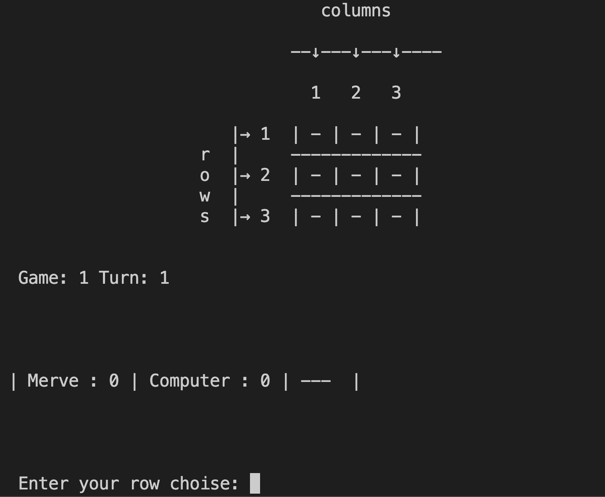

 # XOX-GAME
 [XOX-GAME](https://tic-tac-toe-game-merve-f793c47a141b.herokuapp.com/) This project is a game project. It is a popular game also known as tic-tac-toe-game. XOX-GAME is run and played within the terminal. The system runs on a mock terminal through [Heroku](https://id.heroku.com/login) It is a game that can be played 3 times between the computer and one player and results in winning, drawing or losing.
 Click here to play the game: [XOX-GAME](https://tic-tac-toe-game-merve-f793c47a141b.herokuapp.com/)

 

## How to Play

When we click on the live link [XOX-GAME](https://tic-tac-toe-game-merve-f793c47a141b.herokuapp.com/) to start the game, we are greeted with this start screen. We see a menu that will help guide us, and we proceed by typing a number between 1 and 3 to select the option we want.

 ### If we choose 1 from the menu

 

If we choose 1. The rules tab will open and we can see the rules of the game as shown in the picture above.

### If we choose 2 from the menu

 

If we choose 2, the game will start and ask us to enter a username. If an invalid character is entered, we will see a warning message on this screen.

### If we choose 3 from the menu

If 3 is selected from the menu, you will be exited and this screen will be seen.

## Features

### Existing Features

After entering the username, the next step is to start the game and a choice is made between X and O(we use letter O, it is not a number)

After the sign is selected, the computer and the user randomly choose who will start playing first and the game begins.

Then, who will play first is written on the screen, and if the player is selected to make the first move, after the initial score information is given, player is asked for information on which cell player will tick on the game board and the choice is made.

#### for row:

#### for column:

After the choice is made, we can see the sign placed on the game board.

If the computer is going to play first, a message is given that the computer will play, then the move is passed to the other player.

If the player wants to re-select a previously selected location, he/she will encounter a warning like the one in the picture below.

